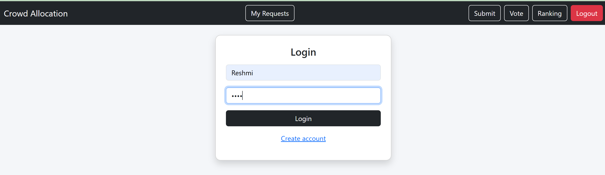
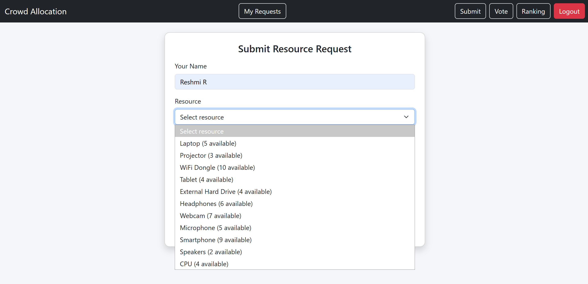
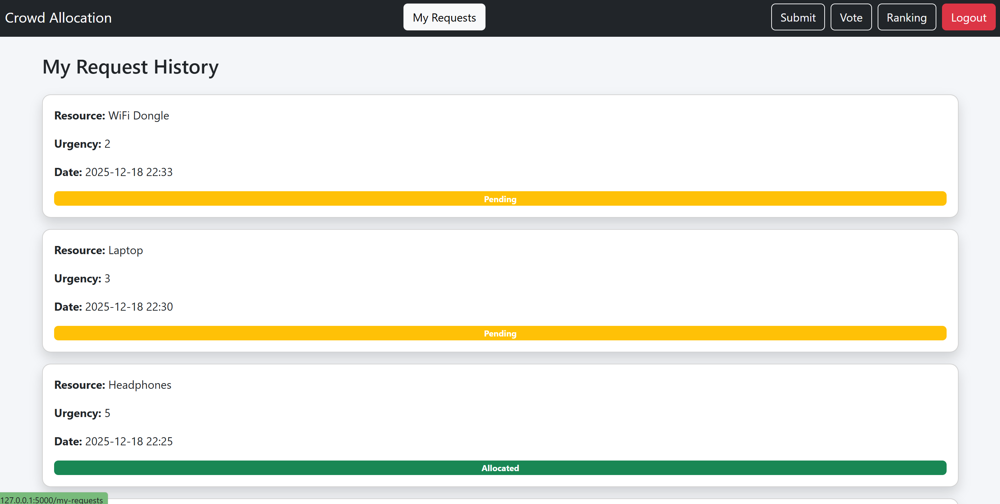
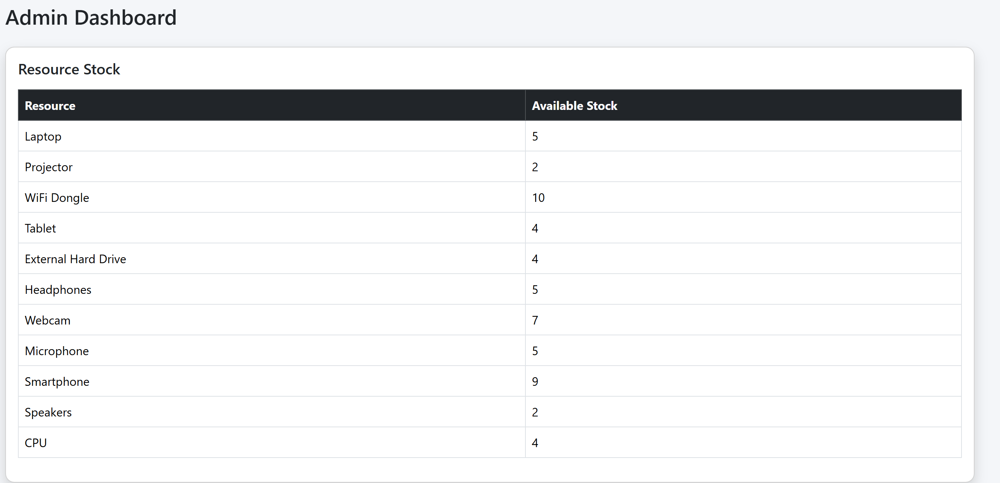
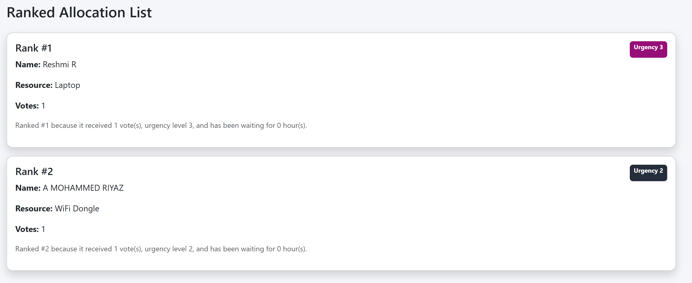
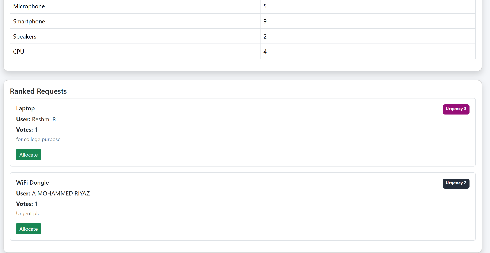

#  Crowd-Sourced Resource Allocation Tool

A full-stack web application designed to **fairly allocate limited resources** under high demand using **community voting, urgency scoring, waiting-time logic, and explainable ranking**.

##  Problem Statement

In many real-world scenarios (colleges, offices, labs), resources such as laptops, projectors, or network devices are limited.  
Allocating them fairly becomes difficult and often leads to biased or unclear decisions.

This project provides a **transparent, community-driven solution** where:
- Users request resources
- The community votes
- A ranking algorithm decides priority
- Admins perform final allocation

## 🎯 Objectives

- Ensure fair allocation of limited resources  
- Avoid duplicate and biased voting  
- Prioritize urgent and long-waiting requests  
- Provide explainable and transparent ranking  
- Maintain admin-controlled stock allocation  

## 🛠️ Tech Stack

| Layer | Technology |
|------|-----------|
| Frontend | HTML, Jinja2, Bootstrap 5 |
| Backend | Python (Flask) |
| Database | SQLite (SQLAlchemy ORM) |
| Authentication | Session-based |
| Version Control | Git & GitHub |

## ✨ Features

### 👤 User Features
- User registration & login
- Submit multiple resource requests
- Select urgency level (1–5)
- Vote on community requests (one vote per user)
- View ranked allocation list
- View personal request history
- Track request status (Pending / Allocated)

### 🧑‍💼 Admin Features
- Role-based admin access
- View available resource stock
- View ranked pending requests
- Allocate resources
- Automatic stock reduction
- Allocated requests removed from ranking

## 🧠 Ranking Logic (Explainable)

Each request is ranked using a **Final Score** calculated as:
Final Score =
(Votes × 10) + (Urgency × 2) + Waiting Time Bonus

Where:
- **Votes** = Number of community votes  
- **Urgency** = User-selected urgency (1–5)  
- **Waiting Time Bonus** = Based on how long the request has been waiting (max 10 points)

## 📊 Example Ranking Explanation

> Ranked #1 because it received 3 votes, has urgency level 5, and has been waiting for 4 hours.

## 🖥️ Application Routes

| Route | Description |
|-----|------------|
| `/register` | User registration |
| `/login` | User login |
| `/` | Submit resource request |
| `/vote` | Vote on community requests |
| `/ranking` | Ranked allocation list |
| `/my-requests` | User request history |
| `/admin` | Admin dashboard |

## 🧩 Database Design

### Entities
- **User**
- **Resource**
- **ResourceRequest**
- **Vote**

### Relationships
- One User → Many Requests  
- One Request → Many Votes  
- One Resource → Stock-based allocation  

## 🔐 Security & Fairness

- Session-based authentication
- Role-based access control (Admin / User)
- Duplicate vote prevention
- Server-side validation
- Admin-only allocation authority

## 📸 Screenshots

### 🔐 Login Page

### 📝 Submit Request

### 🧑‍💼 Request History

### 🧑‍💼 Admin Dashboard

### 🗳️ Voting Page

### 📊 Ranking Page

### 🧑‍💼 Admin Special pop up

### 🧑‍💼 Admin Dashboard

### 🧑‍💼 Admin allocation

